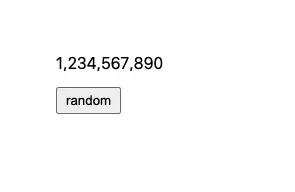

<h1 align="center">✨ mechanical counter ✨</h1>

<div align="center">
  <strong>robinhood inspired mechanical counter</strong>
</div>
<div align="center">
  built with <code>react</code> and <code>framer-motion</code>
</div>
<br />
<div align="center">

[](https://github.com/prettier/prettier)
[](https://github.com/bitttttten/mechanical-counter/releases)
[](https://github.com/bitttttten/mechanical-counter/compare/v1.0.0...main)
[](https://www.npmjs.com/package/mechanical-counter)

</div>



## Install

```sh
npm i framer-motion mechanical-counter
```

## Usage

```js
import { MechanicalCounter } from "mechanical-counter";

export function App() {
  return <MechanicalCounter text="1337.12" />;
}
```
