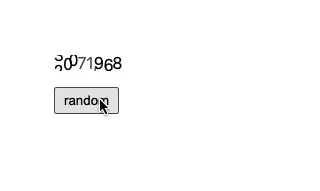
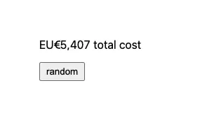

<h1 align="center">✨ mechanical counter ✨</h1>

<div align="center">
  <strong>robinhood inspired mechanical counter</strong>
</div>
<div align="center">
  built with <code>react</code> and <code>framer-motion</code>
</div>
<br />
<div align="center">
  <a href="https://main--617315b23667c2003a0d878b.chromatic.com">👉 live preview 👈</a>
</div>
<br />
<div align="center">

[](https://github.com/prettier/prettier)
[](https://github.com/bitttttten/mechanical-counter/releases)
[](https://github.com/bitttttten/mechanical-counter/compare/__version__...main)
[](https://www.npmjs.com/package/mechanical-counter)

</div>



## Install

```sh
npm i framer-motion mechanical-counter
```

## Usage

```js
import { MechanicalCounter } from "mechanical-counter";

export function App() {
  return <MechanicalCounter text="1337.12" />;
}
```

### Help

The component will only animate numbers and common number separators: `,`, `.`, and `-`. If you want to include text before the number, then you must include that along side the component. It's totally fine to include non-supported characters in the text you send in to the component through the "text" prop, however, they must be added as a suffix to the text.

Here is an example of adding text before the number, as a prefix, and also including some plain text—that is "unsupported characters"—after the number, as a suffix.

```js
<div style={{ display: "flex", alignItems: "center" }}>
  EU€
  <MechanicalCounter text="5,407 total cost" />
</div>
```

The code above will result in the following:


